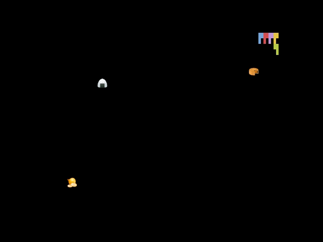

# curlyboi



Simple [curlyboi](https://github.com/glasnt/curlyboi) game written in C using ncurses.

## Installation

```
$ pip install curlyboi
```

## Usage

```
$ curlyboi
```

## Versioning

curlyboi uses [Semantic Versioning](https://semver.org/). For the available versions, see the tags on this repository.

## License

This project is licensed under the MIT License, see the [LICENSE](https://raw.githubusercontent.com/vinayak-mehta/curlyboi/master/LICENSE) file for details.
